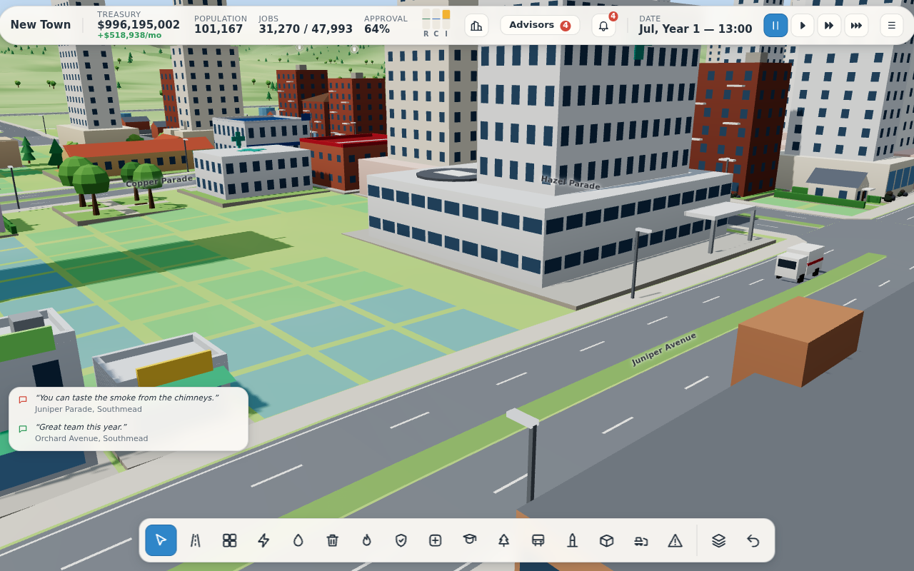

# Citybloom

An original 3D city-building game for the browser. Lay roads across a green valley, zone homes,
shops and industry, and keep the city powered, watered, safe, healthy and solvent while it grows
from a hamlet into a city of a hundred thousand. Every resident, car and bus is simulated; pollution
drifts on the wind; fires, earthquakes, tornadoes, floods and meteors test the city from time to time.



Built with TypeScript, Vite, Three.js and Preact. All models, icons and sounds are generated in
code; there are no bought or borrowed assets (see `CREDITS.md` for the open-source libraries).

## Run it

Needs Node.js 20.19+ or 22.12+ and a browser with WebGL2.

```sh
npm install
npm run dev          # play at http://localhost:5173
```

To build a static copy you can host anywhere (it's plain files; saves live in the browser):

```sh
npm run build        # type-checks, then writes dist/
npm run preview      # serves dist/ at http://localhost:4173
```

## Play

The main menu opens over a small town that keeps living in the background. Choose **New city**,
pick a map (river, coast, lakes or highlands), a seed, a difficulty, and whether you want sandbox
money or random disasters. The tutorial is on for your first city and walks through the basics:

1. **Roads** off the highway: drag to draw a straight road, or click point to point to keep going;
   the curve tool takes a start, a bend and an end, and the free tool follows the mouse.
2. **Zones** beside them: residential, commercial and industrial. Buildings grow on their own when
   there's demand (the R, C and I bars in the top bar tell you what the city wants, and why).
3. **Power, water and sewage** from the Utilities menu. Homes without them empty out.
4. **Garbage, fire, police, health, schools and parks** as the town grows. The advisors say what's
   missing, and the data maps show where.
5. **Taxes and budget**: the budget panel shows every line of income and cost. Keep an eye on it.

New buildings, services, policies and landmarks unlock as the population passes each milestone.
Later on, a city can specialise in tourism, trade or technology, and mine ore or pump oil where the
ground holds them.

### Controls

| Action | Mouse | Keys |
| --- | --- | --- |
| Pan | drag with the left button (when the tool doesn't use it) or middle button; screen edge (setting) | W A S D / arrow keys |
| Rotate and tilt | drag with the right button | Q / E rotate, R / F tilt |
| Zoom | wheel | |
| Road tool | | T |
| Zone residential / commercial / industrial / dezone | | Z / X / C / V |
| Bulldoze | | B |
| Select and inspect | click a building, car, walker or road | H |
| Cancel, leave a tool, close a panel, pause menu | right click | Escape |
| Undo | | Ctrl+Z or U |
| Pause / speeds | top bar | Space, 1, 2, 3 |
| Budget / advisors / notifications / city | top bar | M / J / N / P |
| Data maps | toolbar | L toggles the power map |
| Debug panel (FPS, cheats) | | backtick |

The pause menu (Escape) has save, load, settings (graphics quality, shadows, draw distance,
interface size, volumes, edge scrolling, disasters, autosave) and export/import of `.citybloom`
save files. The city autosaves every few minutes.

## Develop

```sh
npm run typecheck && npm run lint && npm test && npm run e2e   # everything
npm test             # unit and scenario tests (Vitest)
npm run e2e          # end-to-end tests through the real UI (Playwright), with screenshots
npm run soak         # ten minutes of top-speed play with disasters; fails on any console error
npm run bench        # sim tick timing (add --big for a ~100k-resident city)
npm run balance      # scripted players over 20 game years: careful, greedy, neglectful
```

The simulation is pure, deterministic TypeScript running in a Web Worker (`src/sim`); the page
renders a mirror of it (`src/client`, `src/render`) and every player action is a command, so the
same seed and commands always give the same city. Balancing numbers live in `src/data`.

- `SPEC.md`: the brief.
- `DESIGN.md`: the technical design (architecture, simulation model, rendering, saves).
- `PROGRESS.md`: where things stand, known issues, performance numbers and ideas for what's next.
- `docs/DECISIONS.md`: the design calls made along the way, one line each.
- `docs/SPEC_REVIEW.md`: every item in the brief and where it's done.
- `CLAUDE.md`: working notes, dev scripts and gotchas.
